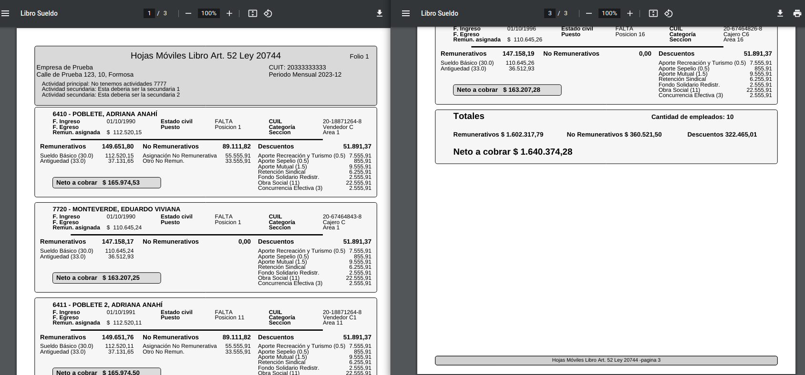

## Reportes para Payroll en Argentina

Este repositorio tiene como objetivo generar todos los reportes necesarios para Payroll en Argentina.
recibiendo un json para cada caso y retornando los distintos reportes en los formatos según el caso pdf, txt, csv, etc.

### Reportes Legales

- F.931
- Libro de Sueldos Digital
- Libro de Sueldos
- Sicore
- F.1357


### Reportes Sindicales

- Comercio
- UOM
- UOCRA
- UTHGRA
- Etc.


### Reportes Bancarios

- Banco Galicia
- Banco Santander
- Banco Nación
- Etc.


### Reportes de Liquidación

- Resumen de Liquidación
- Conceptos Liquidados por Empleado
- Planilla de Ganancias

### Reportes Informativos

- Lista de empleados
- Lista de empleados con datos personales
- Etc.


## Instalación

```bash
pip install payroll-arg-reportes
```

### Uso

#### Recibo de Sueldos

Ver modelo de JSON usados en [samples-recibo-info.json](py_arg_reports/reporters/samples/samples-recibo-info.json) o [liquidacion_corta.json](py_arg_reports/test_cases/liquidacion_corta.json)


```python
import json

from py_arg_reports.reporters.recibo_sueldo import descargar_recibo

with open('py_arg_reports/test_cases/liquidacion_corta.json', 'r') as f:
    liquidacion = json.load(f)

# Llamo a la función descargar_recibo
resultado_descarga = descargar_recibo(
    json_data=liquidacion,
    output_path='./downloads/',
    filename='recibo_prueba',
)
```

#### Descarga de Excel
Genera la información binaria para descargar un archivo excel.

El formato de info_dict debe venir de esta manera:

```
info_dict = {
    'headers': {
        'header1': {
            'name': 'Es Texto',
            'format': {'font_name': 'Arial', 'font_size': 8}
        },
        'header2': {
            'name': 'Es Dinero',
            'format': {'num_format': '$#,##0.00'},
            'is_number': True,
        },
        'header3': {
            'name': 'Es un número',
            'format': {'num_format': '0.00'},
            'is_number': True,
        },
    },
    'data': [
        {'header1': 'valor1', 'header2': 1320.10, 'header3': 0.123},
        {'header1': 'valor3', 'header2': 12312.10, 'header3': 2.23},
    ],
}
```

#### Libro Sueldos

Ver modelo de JSON usados en [samples-recibo-info.json](py_arg_reports/reporters/libro_sueldo/samples/samples-recibo-info.json)


```python
import json

from py_arg_reports.reporters.recibo_sueldo import descargar_recibo

my_json = 'py_arg_reports/reporters/libro_sueldo/samples/samples-recibo-info.json
liquidacion = json.load(open(my_json, 'r'))

# Llamo a la función descargar_recibo
resultado_descarga = descargar_recibo(
    json_data=liquidacion,
    output_path='./downloads/',
    filename='libro-sueldo',
)
```

El archivo final estará disponible en `downloads/libro-sueldo.pdf`.  



